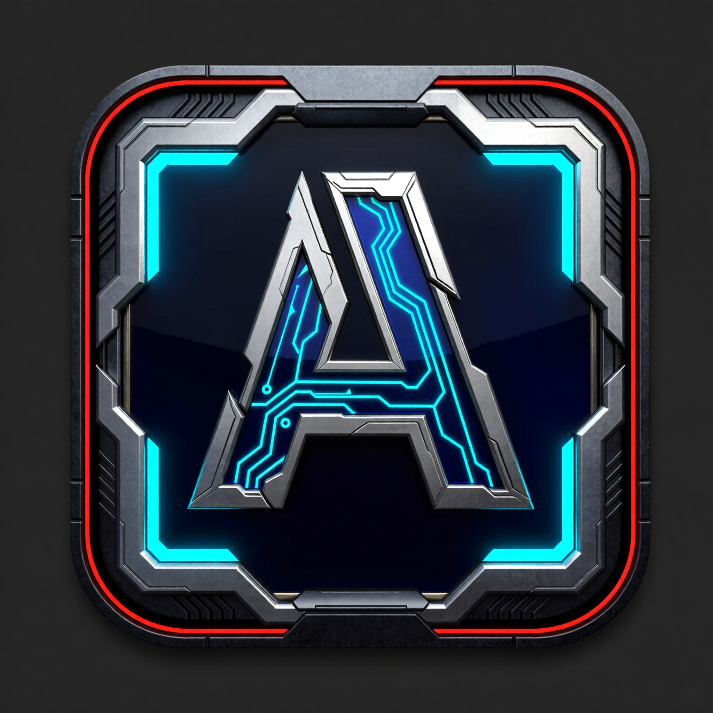
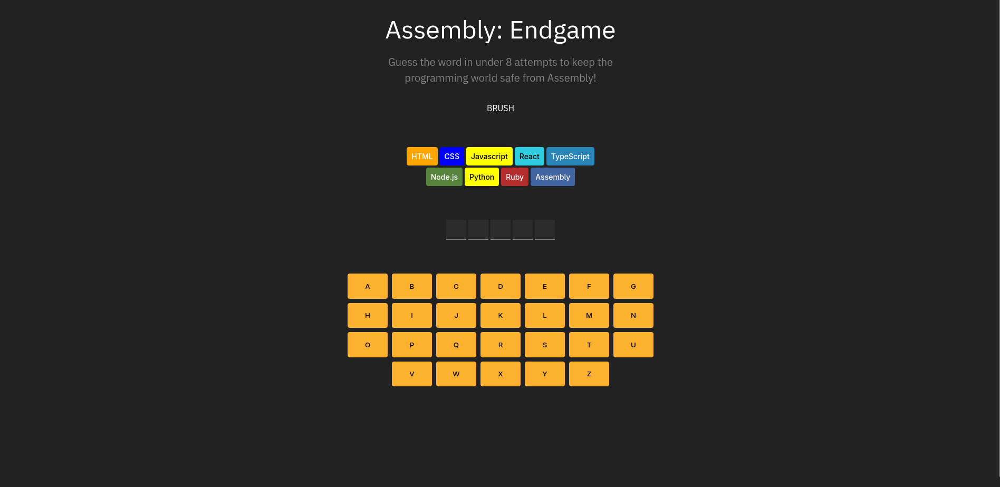
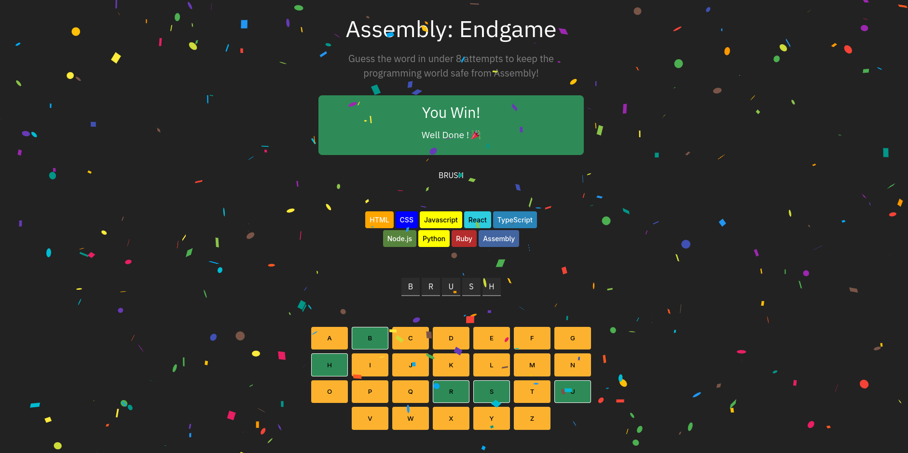
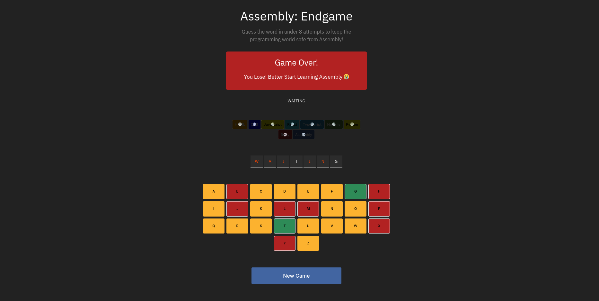

# 🧠 Assembly: Endgame

<p align="center">
  
</p>

**Assembly: Endgame** is a programming-themed word guessing game built with **React and TypeScript**.

Your mission is simple:

Guess the secret word before **Assembly takes over the programming world**.

You have **8 attempts**.
Each incorrect guess eliminates a programming language.

Lose them all… and Assembly wins.

---

## 🎮 Gameplay

- Guess the hidden word letter by letter
- Correct letters reveal their position in the word
- Incorrect guesses eliminate a programming language
- Lose all languages → **Game Over**
- Guess the word before that → **Victory**

Think **Hangman**, but the casualties are programming languages.

---

## 🖼 Screenshots

### Game Start



### Victory Screen



### Game Over



---

## ⚙️ Tech Stack

- **React**
- **TypeScript (TSX)**
- **Rspack**

---

# 📦 Using npm

Install dependencies:

```bash
npm install
```

Start the development server:

```bash
npm run dev
```

Build for production:

```bash
npm run build
```

Preview the production build locally:

```bash
npm run preview
```

---

# ⚡ Using Bun

Install dependencies:

```bash
bun install
```

Run the development server:

```bash
bun run dev
```

Build the project:

```bash
bun run build
```

Preview the build:

```bash
bun run preview
```

---

## 💡 Project Idea

The game is inspired by classic word-guessing games like **Hangman**, but with a programming twist.

Instead of a stick figure, programming languages are progressively eliminated.

Guess the word before **Assembly becomes the only language left standing**.

---

## 🔮 Future Improvements

Planned ideas for expanding the project:

- ⏱ **Timed Guess Mode**
  Add a countdown timer that forces players to guess the word within a limited time.

- 🎊 **Anti-Confetti Animation on Loss**
  Instead of celebration, trigger a playful “anti-confetti” effect when the player loses.

- 💬 **Dynamic Status Messages**
  Display contextual messages when players guess letters correctly.

- 📚 **Word Categories**
  Add categories such as Programming, Technology, and General vocabulary.

- 🎨 **Theme Toggle**
  Support both light and dark mode.

- 📊 **Score Tracking**
  Track wins, losses, and streaks.

- 📱 **Improved Mobile UI**
  Optimize layout and controls for smaller screens.

---

## 📜 License

MIT License
